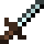
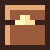

# DungeonCrawlerJava

This a game where you can explore a dungeon filled with enemies, healing items, and weapons (to fight the enemies). This project was made for my AP Computer Science A final project.

This project was made using LWJGL, which is a lightweight and low level way to create graphics in Java. It is built on top of OpenGL.

# Installation Information

## Setting up a project and running
You can install the game by:
1. Download the source code from the latest release in the [releases section](https://github.com/AlexanderJCS/DungeonCrawlerJava/releases).
2. Extract the file and create a new IntelliJ project from the source code.
3. In IntelliJ, open File -> Project Structure -> Libraries.
4. Click the "+" icon in the top left, then click "Java" and select the directory `/libs`.
5. Wait for the project to index. This may take some time.
6. Run Game.java to run the game. Refer to the "Game Information" section of this README to learn about controls,  items and objects in the game.

# Configuring the game
To configure the game, modify the [Consts.java file](src/main/java/helper/Consts.java). This file contains information such as the world seed, screen dimensions, and FPS limiter.

## Modifying screen size
If the window is too small or large, you can change the dimensions by modifying `SCREEN_WIDTH` to a more appropriate value. Note that `SCREEN_WIDTH` must be divisible by 32 for the screen to render properly. Aspect ratios other than 16:9 are not supported.

## Modifying the world seed
To modify the world seed, set `SEED` to any integer. This will create a different world when running the game.

# Game Information
## Controls
### Movement
| Control        | Action             |
|----------------|--------------------|
| W              | Move up            |
| A              | Move left          |
| S              | Move down          |
| D              | Move right         |
| Move offscreen | Move to a new room |

### Inventory

| Control                                             | Action           |
|-----------------------------------------------------|------------------|
| Tab                                                 | Reveal Inventory |
| Click on unselected item when inventory is revealed | Select item      |
| Click on selected item when inventory is revealed   | Deselect item    |
| Space                                               | Use item         |

## Items
### Sword

The last direction key that you pressed is the place where your attack will be executed. For example, if the last movement was "D", the attack will be executed to the right (since D moves the player to the right).

Press the space bar to attack an enemy. When the enemy is near enough, it will move backwards and take damage. Three hits are needed to kill an enemy.

### Heart

Press space bar to use a heart. Using a heart will heal one heart in the health bar, which can be seen on the bottom left of the screen. If the health bar reaches 0, the game will reset.

## Game Objects
### Enemies
Enemies will move towards the player until they collide with the player. Once they collide, they will rebound and inflict damage to the player. The player can kill an enemy using a sword and heal from an enemy's attacks using a heart.

### Chests

Moving near a chest will open it. The item will be added to your inventory. If no item is currently selected, it will be automatically selected.

